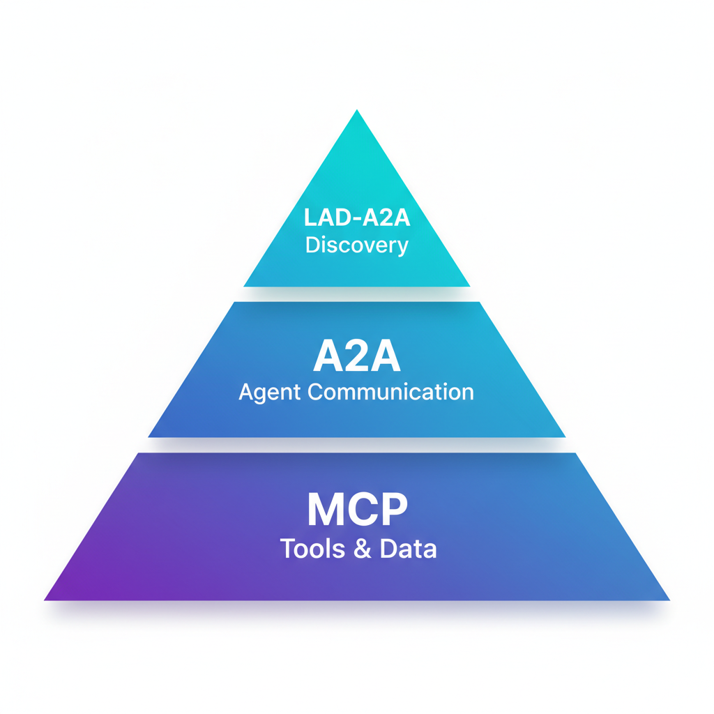

# Local Agent Discovery for A2A (LAD-A2A)

[](LICENSE)
[](spec/spec.md)
[](https://lad-a2a.org)

**An open protocol for discovering A2A-capable agents on local networks.**

LAD-A2A addresses a critical gap in the AI agent ecosystem: when a device joins a network—hotel Wi-Fi, office LAN, cruise ship, hospital campus—how does the user's AI assistant discover and connect to local agents? While [A2A](https://a2a-protocol.org) defines agent-to-agent communication and [MCP](https://modelcontextprotocol.io) defines agent-to-tool integration, **LAD-A2A defines agent discovery**.

With LAD-A2A, agents can:

- **Automatically discover** local A2A agents when joining a network
- **Verify identity** through signed AgentCards and DIDs
- **Obtain user consent** before establishing connections
- **Negotiate capabilities** via standard A2A mechanisms

## Why LAD-A2A?

AI agents are increasingly capable, but they remain isolated from their physical environment. A guest's AI assistant has no way to discover the hotel's concierge agent. An employee's assistant can't find the building's room booking agent. A patient's assistant doesn't know the hospital offers a wayfinding agent.

LAD-A2A solves this by providing:

- **Zero-Configuration Discovery:** Agents find each other automatically via mDNS/DNS-SD, well-known endpoints, or DHCP options.
- **Defense in Depth:** Local networks are hostile by default. LAD-A2A requires TLS, signed AgentCards, verifiable identities (DIDs), and explicit user consent.
- **Graceful Degradation:** Multiple discovery mechanisms ensure compatibility from consumer Wi-Fi to enterprise networks.
- **Ecosystem Alignment:** LAD-A2A only handles discovery—once an agent is found, standard A2A communication takes over.

## How It Fits

<p align="center">
  
</p>

| Protocol | Role | Specification |
|----------|------|---------------|
| **LAD-A2A** | Discovery & Trust Bootstrap | [lad-a2a.org](https://lad-a2a.org) |
| **A2A** | Agent-to-Agent Communication | [a2a-protocol.org](https://a2a-protocol.org) |
| **MCP** | Agent-to-Tools/Data | [modelcontextprotocol.io](https://modelcontextprotocol.io) |

LAD-A2A is the **first handshake**. It answers "who's here?" so that A2A can answer "what can you do?" and MCP can answer "how do I do it?"

## Discovery Mechanisms

LAD-A2A supports multiple discovery paths with automatic fallback:

| Mechanism | Environment | Description |
|-----------|-------------|-------------|
| **mDNS/DNS-SD** | LAN, Consumer Wi-Fi | Zero-config discovery via `_a2a._tcp` service type |
| **Well-Known Endpoint** | Captive Portals, Web | `/.well-known/lad/agents` on the network domain |
| **DHCP Option** | Enterprise Networks | Custom option containing discovery URL |
| **QR/NFC** | Physical Fallback | Direct link to AgentCard for restricted networks |

## See It In Action

<div align="center">

https://github.com/user-attachments/assets/a6a06e95-729b-465a-857c-6a87da52b302

<em>Real mDNS discovery → LAD-A2A protocol → A2A JSON-RPC communication</em>

</div>

## Getting Started

### Interactive Demo (Recommended)

Experience LAD-A2A with a fully working demo featuring two AI agents:

```bash
cd demo
cp .env.example .env
# Add your OpenAI API key to .env
./run_demo.sh
```

Open http://localhost:8000 to see:
- Real mDNS discovery (`_a2a._tcp.local`)
- LAD-A2A protocol in action
- A2A JSON-RPC 2.0 communication
- LLM-based query routing

See [demo/README.md](demo/README.md) for full documentation.

### Docker Network Simulation

```bash
cd reference/simulation
./run.sh
```

This spins up a Docker network with multiple agents and demonstrates the full discovery flow.

### Run Locally

```bash
cd reference
pip install -e .

# Start a discovery server
python -m server.lad_server --name "My Agent" --port 8080

# Discover agents (in another terminal)
python -m client.lad_client --url http://localhost:8080
```

## Example: Hotel Concierge

```
1. Guest device joins "ExampleHotel-Guest" Wi-Fi
2. Client queries mDNS for _a2a._tcp.local
   └─ Fallback: GET https://portal.examplehotel.com/.well-known/lad/agents
3. Discovery response includes AgentCard URL
4. Client fetches and verifies AgentCard (signed, DID-bound)
5. Client prompts user: "Hotel Concierge agent found. Connect?"
6. User approves → Standard A2A session begins
7. User asks: "What time is breakfast?" → Agent responds via A2A
```

## Security Model

Local networks are **hostile by default**. LAD-A2A mandates:

| Requirement | Description |
|-------------|-------------|
| **TLS Required** | All AgentCard fetches and A2A sessions must use HTTPS |
| **Signed AgentCards** | JWS signatures or DID-based identity verification |
| **User Consent** | Explicit approval before first connection to any discovered agent |
| **Capability Scopes** | Agents declare capabilities; clients enforce least privilege |
| **Authentication** | OAuth2/OIDC for privileged operations |

## Documentation

**📚 Full documentation at [lad-a2a.org](https://lad-a2a.org)**

| Resource | Description |
|----------|-------------|
| 📖 [Specification](https://lad-a2a.org/spec/spec/) | Full protocol specification with JSON schemas |
| 🔧 [Reference Implementation](https://lad-a2a.org/reference/) | Python server and client libraries |
| 🧪 [Network Simulation](https://lad-a2a.org/reference/simulation/) | Docker-based multi-agent testing environment |
| 📚 [Examples](https://lad-a2a.org/examples/) | Integration scenarios and use cases |

## Use Cases

| Environment | Example Interaction |
|-------------|---------------------|
| **Hotels** | "What's the spa schedule?" / "Request late checkout" |
| **Cruise Ships** | "Where's tonight's show?" / "Book shore excursion" |
| **Offices** | "Book conference room 4B" / "Find available desks" |
| **Hospitals** | "Navigate to radiology" / "Check appointment status" |
| **Stadiums** | "Find my seat" / "Order food to section 112" |
| **Smart Cities** | "Next bus to downtown?" / "Find parking near me" |

## Contributing

We welcome contributions to enhance the LAD-A2A protocol.

- **Questions & Discussions:** [GitHub Discussions](https://github.com/franzvill/lad/discussions)
- **Issues & Feedback:** [GitHub Issues](https://github.com/franzvill/lad/issues)
- **Contribution Guide:** [CONTRIBUTING.md](CONTRIBUTING.md)

## License

This project is licensed under the [Apache License 2.0](LICENSE).
