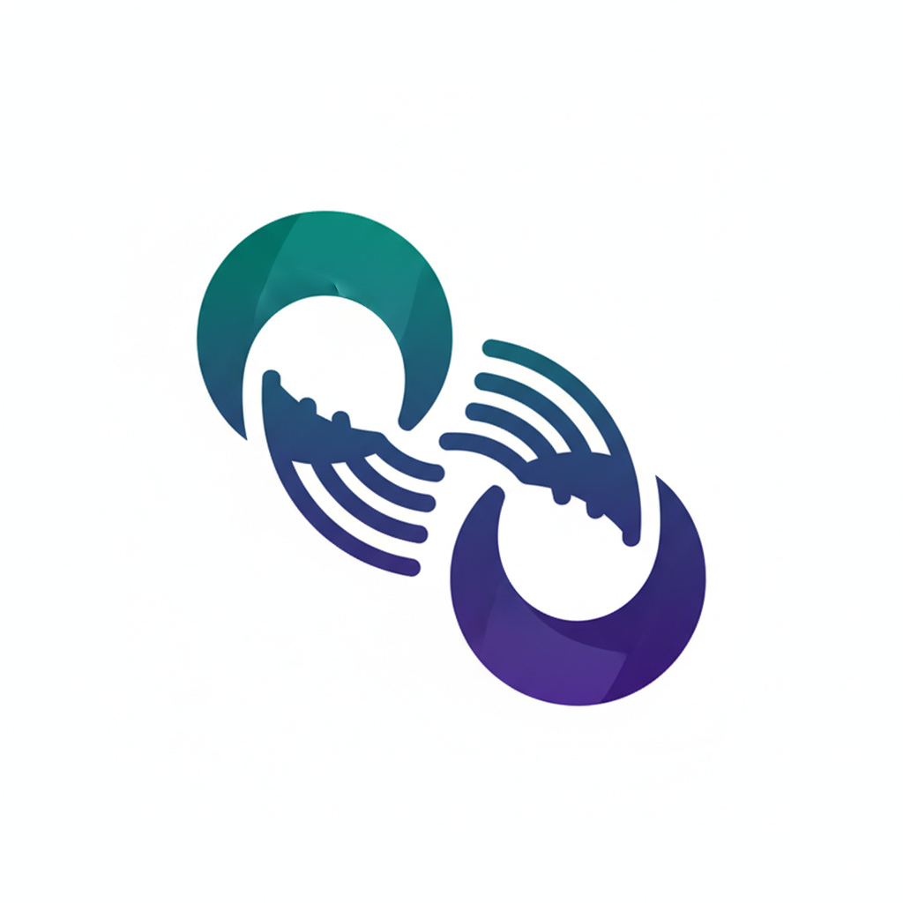

<p align="center">
  
</p>

# Local Agent Discovery for A2A

**An open protocol for discovering A2A-capable agents on local networks.**

---

## The Problem

When a device joins a network—hotel Wi-Fi, office LAN, cruise ship, hospital campus—how does the user's AI assistant discover and connect to local agents?

- [A2A](https://a2a-protocol.org) defines agent-to-agent communication
- [MCP](https://modelcontextprotocol.io) defines agent-to-tool integration
- **LAD-A2A defines agent discovery**

## The Solution

LAD-A2A provides:

- **Zero-Configuration Discovery** via mDNS/DNS-SD, well-known endpoints, or DHCP
- **Defense in Depth** with TLS, signed AgentCards, DIDs, and user consent
- **Graceful Degradation** from consumer Wi-Fi to enterprise networks
- **Ecosystem Alignment** that hands off to standard A2A once discovery completes

## How It Fits

<p align="center">
  
</p>

| Protocol | Role |
|----------|------|
| **LAD-A2A** | Discovery & Trust Bootstrap |
| **A2A** | Agent-to-Agent Communication |
| **MCP** | Agent-to-Tools/Data |

LAD-A2A is the **first handshake**. It answers "who's here?" so that A2A can answer "what can you do?"

## See It In Action

<div align="center">

<video controls autoplay loop muted playsinline width="70%">
  <source src="assets/LAD.mp4" type="video/mp4">
  Your browser does not support the video tag.
</video>

</div>
<p align="center"><em>Real mDNS discovery → LAD-A2A protocol → A2A JSON-RPC communication</em></p>

## Quick Start

### Interactive Demo (Recommended)

Experience LAD-A2A with a fully working demo featuring two AI agents:

```bash
cd demo
cp .env.example .env
# Add your OpenAI API key to .env
./run_demo.sh
```

Open [http://localhost:8000](http://localhost:8000) to see:

- Real mDNS discovery (`_a2a._tcp.local`)
- LAD-A2A protocol in action
- A2A JSON-RPC 2.0 communication
- LLM-based query routing

### Run Locally

```bash
cd reference
pip install -e .

# Start a discovery server
python -m server.lad_server --name "My Agent" --port 8080

# Discover agents
python -m client.lad_client --url http://localhost:8080
```

## Use Cases

| Environment | Example |
|-------------|---------|
| **Hotels** | "What's the spa schedule?" |
| **Cruise Ships** | "Where's tonight's show?" |
| **Offices** | "Book conference room 4B" |
| **Hospitals** | "Navigate to radiology" |
| **Stadiums** | "Find my seat" |
| **Smart Cities** | "Next bus to downtown?" |

## Next Steps

- [Read the Specification](spec/spec.md)
- [Try the Reference Implementation](reference/index.md)
- [See Examples](examples.md)
